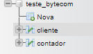
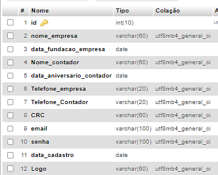
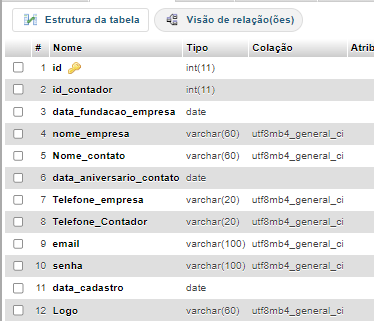

<h1>Teste Bytecom</h1>

<h2>Sobre</h2>

Este projeto serve para a visualização de clientes de contadores. O Contador poderá efetuar cadastro na aplicação, cadastrar e visualizar seus clientes. 
Cada contador após cadastrado e feito login no sistema, poderá ver apenas seus clientes, também podendo editar os dados do cliente e excluir o cliente caso queira. 

<h2>Pre-Requisitos</h2>
<li><a href="https://www.apachefriends.org/pt_br/index.html">Instalação Do XAMPP</a></li>
<li>Nome do Banco MySQL= "teste_bytecom"</li>

<ul>
    <ul>Tabela = "Contador"</ul></li>
           
        <li>id Primária	int(10)</li>
        <li>nome_empresa	varchar(60)</li>
        <li>data_fundacao_empresa	date</li>
        <li>Nome_contador	varchar(60)</li>
        <li>data_aniversario_contador	date</li>
        <li>Telefone_empresa	varchar(20)</li>
        <li>Telefone_Contador	varchar(20)</li>
        <li>CRC	varchar(60)</li>
        <li>email	varchar(100)</li>
        <li>senha	varchar(100)	</li>
        <li>data_cadastro	date</li>
        <li>Logo	varchar(60)</li> 
           
        

<ul>Tabela = "Cliente"</ul>
    
    <li>id Primária	int(11)</li>
    <li>id_contador	int(11)</li>
    <li>data_fundacao_empresa	date</li>
    <li>nome_empresa	varchar(60)</li>
    <li>Nome_contato	varchar(60)</li>
    <li>data_aniversario_contato</li>
    <li>Telefone_empresa	varchar(20)</li>
    <li>Telefone_Contador	varchar(20)</li>
    <li>email	varchar(100)</li>
    <li>senha	varchar(100)</li>
    <li>data_cadastro	date</li>
    <li>Logo	varchar(60)</li>
</ul>
<li><a href="https://www.php.net/">Instalação PHP 8.1.23 </a></li>

<h2>Feaures</h2>  
<ul>
    <li>Cadastro de Contador;</li>
    <li>Login do Contador;</li>
    <li>Logon do Contador;</li>
    <li>Adicionar novos Clientes;</li>
    <li>Editar dados dos clientes existentes;</li>
    <li>Excluir clientes existentes.    </li>
</ul>